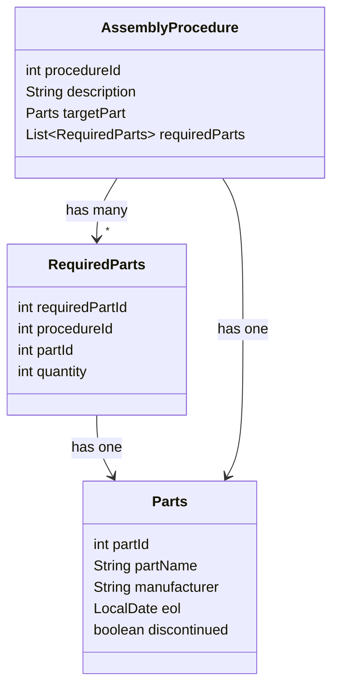
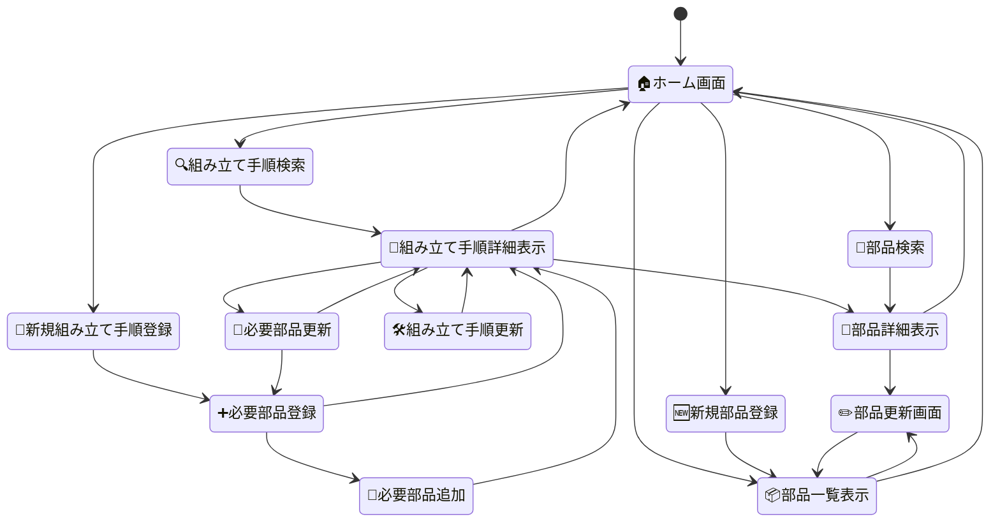
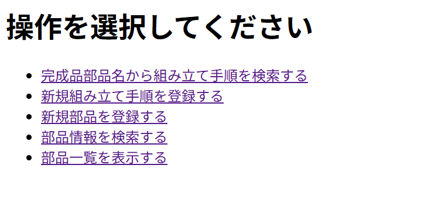
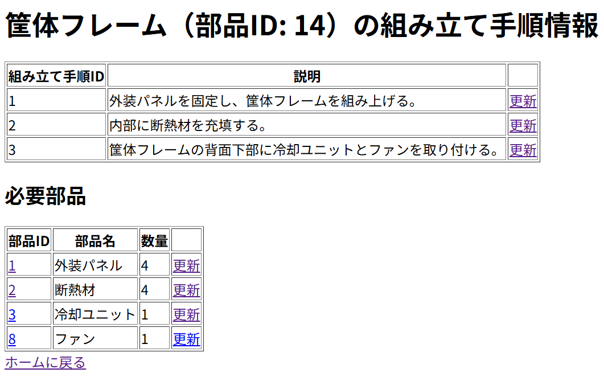
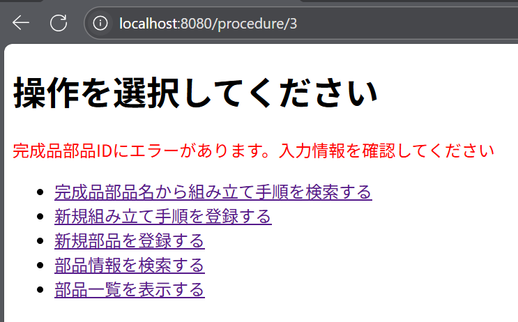
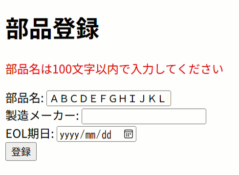

# 製品組み立て手順管理アプリ

製品の組み立て手順と部品情報をWeb上で管理・検索・更新できるアプリケーション

## 制作背景

製造業での製品開発に従事していた際、生産工場への量産移管に立ち合いました。
組み立て手順はエクセルや紙で管理されており、必要な情報の検索や更新に多くの工数がかかっていました。
特に「部品Aの廃止に伴い、組立手順書内の部品Aを全て部品Bへ差し替える」といった変更作業では、
対象手順を把握する手段がなく、地道に調べるしかありませんでした。
こうした課題を解決するため、部品と手順を紐づけてWeb上で管理できるアプリの開発することとしました。

## 概要

### ER図

***



### 状態遷移図

***



### 使用技術

***

- Java 21
- Spring Boot
- Thymeleaf
- MySQL
- Lombok

### 機能一覧

***

|   | 機能              |
|---|-----------------|
| 1 | 部品の登録機能         |
| 2 | 組み立て手順の登録機能     |
| 3 | 組み立てに必要な部品の登録機能 |
| 4 | 部品情報の更新機能       |
| 5 | 組み立て手順の更新機能     |
| 6 | 組み立てに必要な部品の更新機能 |
| 7 | 部品の検索機能         |
| 8 | 組み立て手順の検索機能     |

## 何ができるのか

***

1. ホーム画面
   

- ユーザーが行いたい操作を選択します。
- 操作選択後、それぞれの操作ページに遷移します。


2. 組み立て手順の検索

[手順検索と部品情報更新.mov](img%2FsearchProcedure_updatePart.mov)

1. ホーム画面の[完成品部品名から組み立て手順を検索する]を選択します。
2. 組み立てたい部品名を入力し、[検索]を押下します。
3. 入力した部品を完成品とした組み立て手順が登録されていた場合、組み立て手順詳細情報を表示します。



- 組み立て手順詳細情報には、完成品を作り上げる手順とそれに必要な部品が紐づいています。
- 手順の[更新]ボタンを押下すると、説明文を修正できます。
- 部品IDを選択すると、部品の詳細情報の表示画面に遷移します。
- 必要部品の[更新]ボタンを押下すると、必要部品の情報を修正できます。


3. 組み立て手順情報の更新

   [組み立て手順更新.mov](img%2FupdateProcedure.mov)
    1. 組み立て手順詳細情報画面の手順の[更新]ボタンを選択する。
    2. 説明文を入力する。
    3. [更新]ボタンを押下し、組み立て手順詳細情報を表示します。


4. 必要部品の情報の更新
    1. 組み立て手順詳細情報画面の必要部品の[更新]ボタンを選択する。
    2. 使用する部品IDと必要な数を入力する。
    3. [更新を終了する]を選択すると、組み立て手順詳細情報を表示します。[新規必要部品を登録する]
       を選択すると、組み立てに必要な部品を新たに登録できます。


5. 組み立て手順の登録

   [組み立て手順登録.mov](img%2FregisterProcedure.mov)
    1. ホーム画面の[新規組み立て手順を登録する]を選択します。
    2. 完成部品を組み立てるのに必要な情報（組み立て手順ID(必須)、組み立て説明文(必須)、完成部品名(必須)
       ）を入力します。
    3. [登録]ボタンを押下すると入力した情報を登録でき、必要部品情報の登録画面に遷移します。


6. 必要部品の登録

   [必要部品複数登録.mov](img%2FregisterRequired.mov)
    1. 対象の組み立て手順ID(必須)、部品ID(必須)、必要数(必須)を入力します。
    2. [登録を終了する]を選択すると、対象の組み立て手順詳細情報を表示します。[追加で部品を登録する]
       を選択すると、組み立てに必要な部品を追加で登録できます。


7. 部品の登録
   [部品情報登録.mov](img%2FregisterPart.mov)
    1. ホーム画面の[新規部品を登録する]を選択します。
    2. 品名(必須)、製造会社(任意)、EOL日(任意)を入力します。
    3. [登録]ボタンを押下すると入力した情報が登録でき、登録部品一覧表示画面に遷移します。

- 自分が登録した部品の情報を確認できます。


8. 部品の検索
   [部品情報検索→更新.mov](img%2Fsearch_updatePart.mov)
    1. ホーム画面の[部品情報を検索する]を選択します。
    2. 情報を表示したい部品名を入力します。
    3. [検索]ボタンを押下すると、部品情報が表示されます。

- [更新]ボタンを押下すると、部品情報の更新画面に遷移します。


9. 登録部品の一覧表示
    1. ホーム画面の[部品一覧を表示する]を選択します。
    2. 登録済みの部品が一覧で表示されます。

- [更新]ボタンを押下すると、部品情報の更新画面に遷移します。


10. 部品情報の更新
    1. 品名(必須)、製造会社(任意)、EOL日(任意)を入力します。
    2. [更新]ボタンを押下すると、登録済みの部品が一覧で表示され更新した情報を確認できます。


11. バリデーション
    1. 空のデータにアクセスしようとしたとき
       
    2. 文字数制限を超えたとき
       


12. 工夫したところ
    1. 必要部品テーブルから表示用オブジェクトに変換しました。
    ```java
      private static List<RequiredPartView> getRequiredPartViews(Map<Integer, Parts> partsMap,
          List<RequiredParts> requiredPartsList, AssemblyProcedure procedure) {
        List<RequiredPartView> requiredPartViews = new ArrayList<>();
    
        for (RequiredParts requiredParts : requiredPartsList) {
          if (procedure.getProcedureId() == requiredParts.getProcedureId()) { //手順IDが等しい場合
            Parts parts = partsMap.get(requiredParts.getPartId());  //  部品IDキーに紐づく部品情報を代入
            if (parts != null) {     //部品がある場合
              addToViewList(requiredParts, parts, requiredPartViews); //Viewリストに追加
            }
          }
        }
        return requiredPartViews;
      }
    ```

    2. ユーザーが選択によって画面遷移先を定めるため、RequestParamを使って遷移先を決定しました。
    ```java
      @PostMapping("/parts/required")
      public String registerRequiredPart(@ModelAttribute RequiredParts requiredPart,
          BindingResult result, Model model, @RequestParam("action") String action) {
        if (result.hasErrors()) {
          model.addAttribute("requiredPart", requiredPart);
          return "registerRequiredPart";
        }
        service.resisterNewRequiredPart(requiredPart);
        if ("add".equals(action)) {
          return "redirect:/parts/required/new";
        } else if ("finish".equals(action)) {
          AssemblyProcedure procedure = service.getAssemblyProcedureByProcedureId(
              requiredPart.getProcedureId());
          int targetPartId = procedure.getTargetPartId();
          return "redirect:/procedure/" + targetPartId;
        }
        return "registerRequiredPart";
      }
     ```

13. 今後の展望
    1. 部品情報の「EOL日」を利用した検索機能
        - EOL日が近い順にソートを行い、代替品対応業務を行いやすくする。
    2. 部品情報の「終売フラグ」を利用した検索機能
        - 終売フラグがtrueの部品は組み立て手順に使用できないように制限を与える。
    3. 部品情報一覧から組み立て手順詳細情報への遷移
        - 部品がどの工程で使用されているか検索できる機能を加える。


