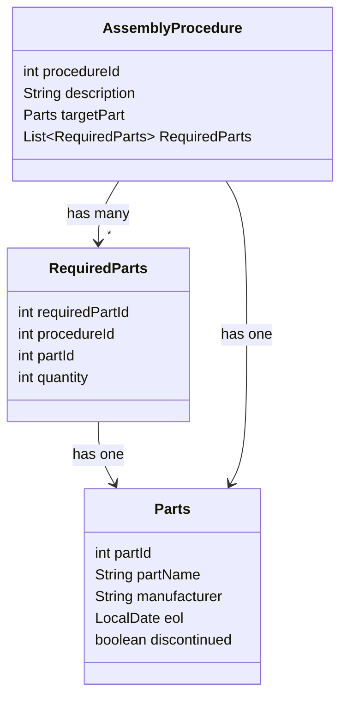

```mermaid
classDiagram
    class AssemblyProcedure {
        int procedureId
        String description
        Parts targetPart
        List~RequiredParts~ RequiredParts
    }

    class RequiredParts {
        int requiredPartId
        int procedureId
        int partId
        int quantity
    }

    class Parts {
        int partId
        String partName
        String manufacturer
        LocalDate eol
        boolean discontinued
    }

    RequiredParts--> Parts: has one
    AssemblyProcedure --> Parts: has one
    AssemblyProcedure --> "*" RequiredParts: has many

```
