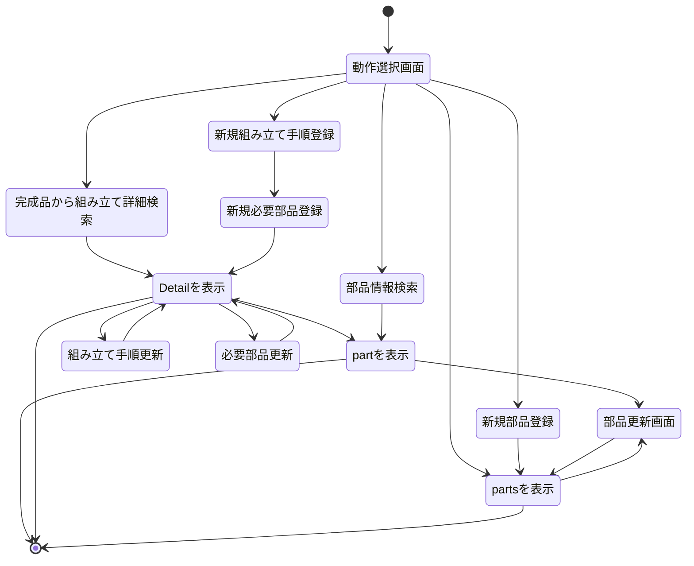

```mermaid

stateDiagram-v2
[*] --> 動作選択画面
    動作選択画面 --> 完成品から組み立て詳細検索
    動作選択画面 --> 新規組み立て手順登録
    動作選択画面 --> 新規部品登録
    動作選択画面 --> 部品情報検索
    動作選択画面 --> partsを表示
    完成品から組み立て詳細検索 --> Detailを表示
    Detailを表示 --> partを表示
    新規組み立て手順登録 --> 新規必要部品登録
    新規必要部品登録 --> Detailを表示
    新規部品登録 --> partsを表示
    部品情報検索 --> partを表示
    partを表示 --> 部品更新画面
    部品更新画面 --> partsを表示
    Detailを表示 --> 組み立て手順更新
    組み立て手順更新--> Detailを表示
    Detailを表示 --> 必要部品更新
    
    必要部品更新 --> Detailを表示
    partsを表示 -->  部品更新画面
    partを表示--> [*]
    Detailを表示--> [*]
    partsを表示 --> [*]


```