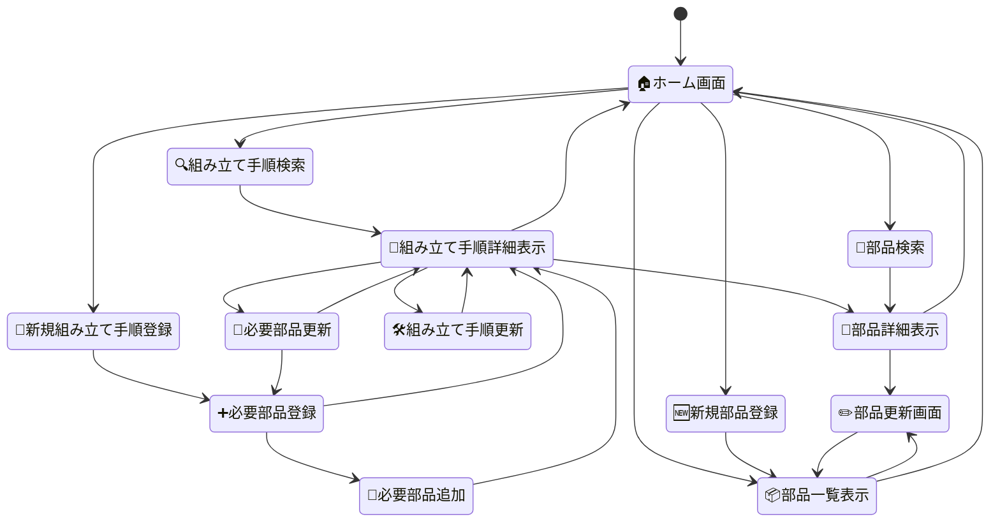

```mermaid

stateDiagram-v2
[*] --> 🏠ホーム画面
🏠ホーム画面 --> 🔍組み立て手順検索
🏠ホーム画面 --> 🧩新規組み立て手順登録
🏠ホーム画面 --> 🆕新規部品登録
🏠ホーム画面 --> 🔎部品検索
🏠ホーム画面 --> 📦部品一覧表示

🔍組み立て手順検索 --> 📝組み立て手順詳細表示
📝組み立て手順詳細表示 --> 📄部品詳細表示

🧩新規組み立て手順登録 --> ➕必要部品登録
➕必要部品登録 --> 📝組み立て手順詳細表示
➕必要部品登録 --> 🔄必要部品追加
🔄必要部品追加 --> 📝組み立て手順詳細表示

🆕新規部品登録 --> 📦部品一覧表示
🔎部品検索 --> 📄部品詳細表示
📄部品詳細表示 --> ✏️部品更新画面
✏️部品更新画面 --> 📦部品一覧表示

📝組み立て手順詳細表示 --> 🛠組み立て手順更新
🛠組み立て手順更新 --> 📝組み立て手順詳細表示

📝組み立て手順詳細表示 --> 🔧必要部品更新
🔧必要部品更新 --> 📝組み立て手順詳細表示
🔧必要部品更新 --> ➕必要部品登録

📦部品一覧表示 --> ✏️部品更新画面
📦部品一覧表示 --> 🏠ホーム画面
📄部品詳細表示 --> 🏠ホーム画面
📝組み立て手順詳細表示 --> 🏠ホーム画面

```
